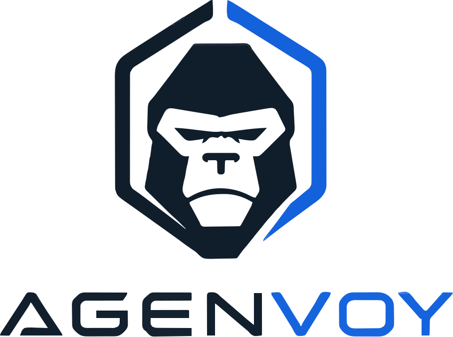

  <picture>
    
  </picture>

  <strong>A local AI Agent & MCP server that builds its own tools</strong>

  Agenvoy runs entirely on your machine. 
  Turn one sentence into a working tool — it builds, tests, schedules, and exposes it via MCP.

  
  
  

---

### Core Capabilities

- **One-sentence tool creation** — Missing tools are written, tested, and scheduled automatically.
- **MCP Server** — The tool library is simultaneously available to Agenvoy, Claude Code, Codex, and other agents.
- **Local-first** — All computation and data stay on your machine.
- **Multi-step workflows** — File search, scheduled tasks, and memory management handled in one place.
